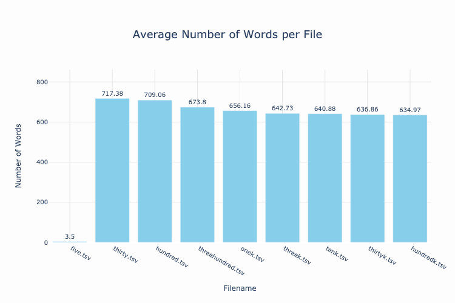
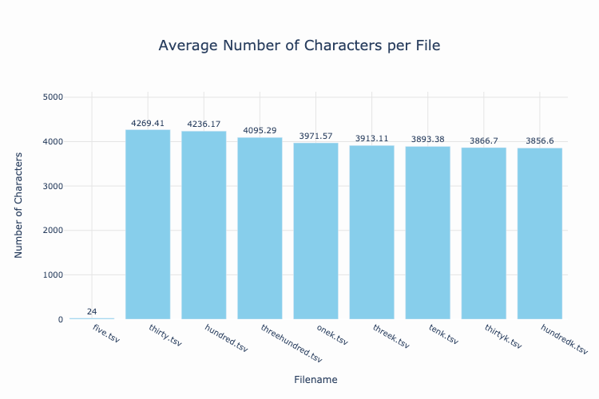
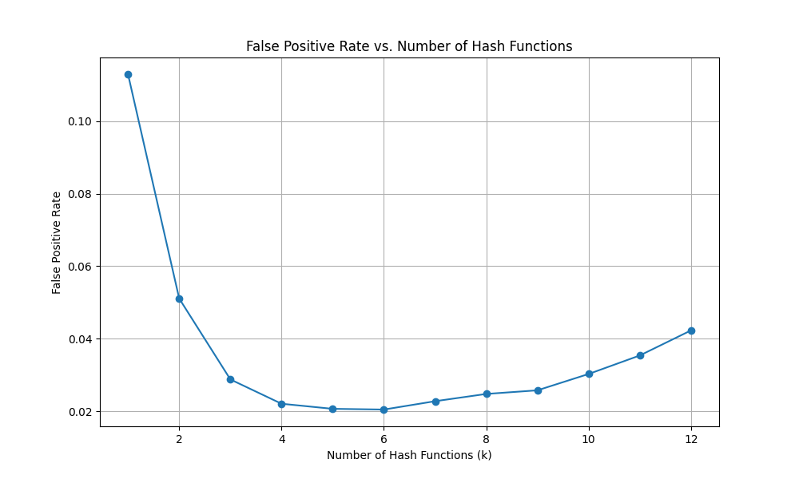
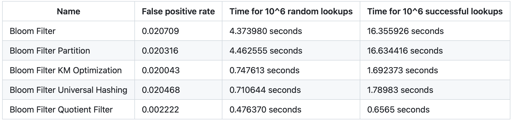
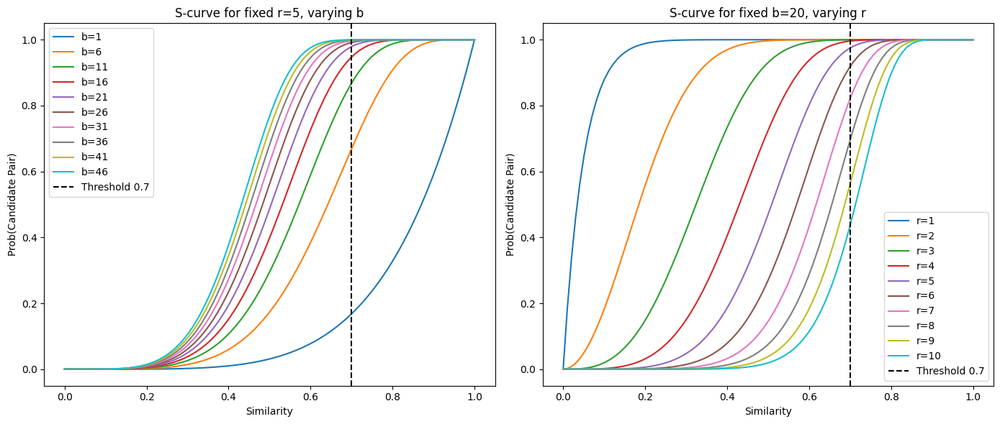
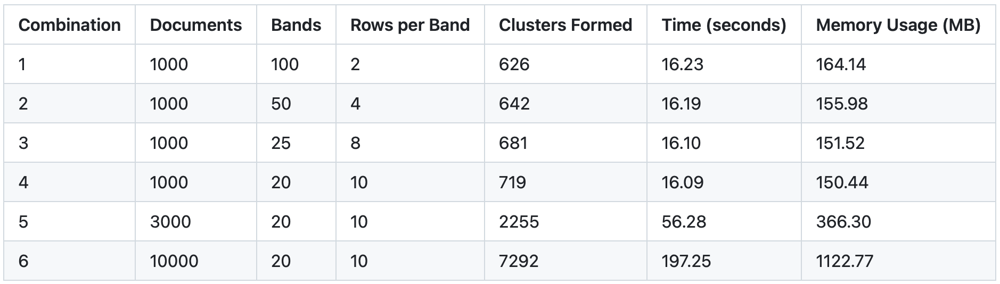
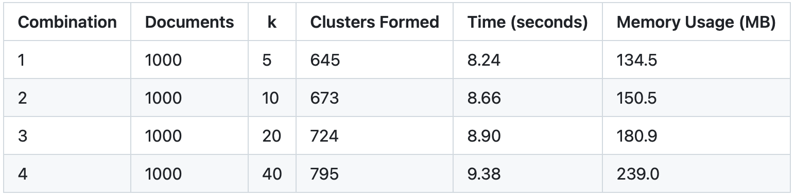
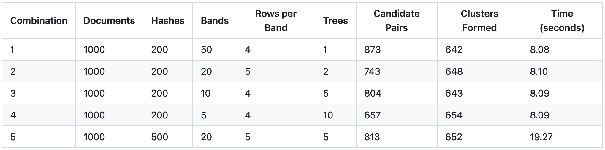
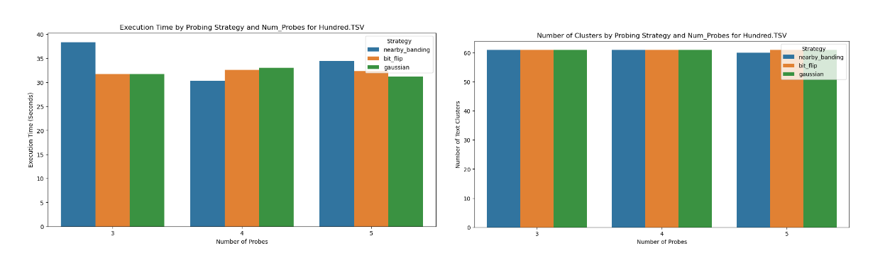

# Assignment 2 Discussion

## Exploratory Data Anlysis Discussion

In the following section we will perform Exploratory Data Analysis (EDA) on the text files provided. The files contain different number of documents which can be idenfitied by the name of the files. The lenght of the document vary so we need to make some calculations to understand the data better and find some insights. The average number of words for all the documents is 636 words. The average number of characters for all documents is 3863 characters.

**What is the average number of words and characters per file?**

In the following visualizations we can observe the plot with the number of words per file on the left and the plot with the number of characters per file on the right:

    
    

The left visualization shows that, except for the file with 5 documents, the average number of words per file decreases as the number of documents increases. The previous average of 636.21 is misleading due to this outlier.

Similarly, the right visualization indicates that the average number of characters per file also declines with more documents. Overall averages for characters and words are unrepresentative due to the influence of files with fewer documents.

## Results Discussion

### Bloom Filter Plot

Using the inital Bloom Filter we plot the False Positive Rate for different numbers of hash functions represented by the k argument in the function. This will allow to determine the number of hash functions that minimize the false positive rate.

As we can observe in the plot above, the k value that minimizes the False Positive Rate is 5. We can also accomplish this in a most efficient way by using the optimization k function: $k_{opt} = \frac{m}{n}ln2$

### Bloom Filter Discussion

For the implementation of the Bloom Filter we completed the completed the exercises in the "Algorithms and Data Structures for Massive Datasets" book. The first implementation is an initial Bloom Filter model. The parameters used for the Bloom Filter class were n, f, m and k, and we defined them in the following way:

- $n = 10^6$
- $f = \frac{1}{2}^k$
- $m = -\frac{\log(f) \cdot n}{(\log(2))^2}$
- $k = \frac{m \cdot \log(2)}{n}$

In the BloomFilter class, tokenization is achieved by splitting the input string into lowercase words with the `.split()` method, generating n-grams for n values from 1 to 3 to capture individual words and short phrases.

Testing the algorithms on a generated list of random integers showed no need for text normalization. The original Bloom Filter has a false positive rate of 2.07%, with random lookups taking about 4.4 seconds and successful lookups 16.4 seconds. The Bloom Filter Partition improves slightly by partitioning the bit array into k chunks, each hashed with different functions. This results in a lower false positive rate of 2.03% and similar computational times compared to the original filter. Below is a table of the test results:

The Bloom Filter Partition class shows slight improvement over the original. We implemented three modified models based on the initial Bloom Filter by replacing the k hash functions with Kirsch-Mitzenmacher optimization, Universal Hashing, and the Quotient Filter. Testing these models with the previously created data reveals that the Bloom Filter using the Quotient Filter performed best, with significantly lower false positive rates and runtime compared to the others. Thus, we define the Bloom Filter with the Quotient Filter as the improved model.

## LSH

### LSH Plots

S-curve analysis in Locality Sensitive Hashing (LSH) informs parameter choices for *b* (number of bands) and *r* (rows per band) to improve detection probability of similar candidate pairs. In the left plot, with fixed $r = 5$, increasing *b* shifts the S-curve left and steepens it, enhancing detection for similarities approaching the 0.7 threshold, while lower *b* values yield a gradual curve, capturing more lower-similarity pairs but risking false positives. In the right plot, fixing $b = 20$ and increasing *r* moves the curve right, requiring higher similarity for detection.

The combination $b = 20$ and $r = 5$ balances recall and precision by creating a steep transition around 0.7 similarity, reducing false positives by filtering dissimilar pairs while detecting sufficiently similar ones. This setup also maintains computational efficiency, keeping hash computations manageable at $b \times r = 100$, aligning well with the similarity threshold for large datasets.

### LSH Baseline Implementation Choices

In our LSH Baseline, we constructed the process by mapping each document ID to its shingles, applying multiple hash functions, and tracking the minimum hash values, rather than constructing a full characteristic matrix. This parallelized approach mirrors traditional LSH results with added efficiency.

Reference code for the characteristic matrix method is in the notebook/lsh.ipynb file.

**Default parameters**
*The default parameters were selected based on insights from the S-curve and refined through manual experimentation, ensuring optimal cluster formation for each parameter choice.*
 - default_num_hashes = 100 / default_num_bands = 20 / default_rows_per_band = 5 / default_k = 10

### LSH Deduplication Performance based on Band/Row Manipulation

**Hash Functions Set to 200**

### **Runtime and Memory Usage**
We used `psutil` to measure memory usage, observing that memory consumption increased with dataset size and slightly with more bands at a fixed number of hash functions. For instance, 1000 documents required 150 MB with 20 bands and 10 rows, while 10,000 documents with the same setup used 1123 MB. Runtime also scaled with the dataset size, with 1000 documents taking around 16 seconds and 10,000 documents taking nearly 200 seconds.

### **Cluster Formation**
- More rows per band yield more clusters → 1000 documents with 20 bands, 10 rows formed 719 clusters / 100 bands, 2 rows formed 626 → Fewer bands, more rows = stricter clustering
    - Combination 1 Cluster : 17 79 131 149 273 491 619 928
    - Combination 4 Cluster : 17 491 619 928

    **Combination 1 has a more lenient approach to clustering** 
    Documents 17, 79, and 491 seem to come from the same source but differ in starting and ending points. Based on starting points, the similarity ranking is 17, 491, then 79, showing 17 is closer to 491 than 79. Increasing rows per band, with a constant number of hash functions, creates a stricter clustering model.

### LSH Deduplication Performance based on Shingle Length Manipulation
**Hash Functions Set to 100 (20 Bands / 5 Rows)**

- Higher shingle length *k* → more clusters, finer document distinctions.
- LSH stays efficient as *k* grows, but may slow with larger datasets.
- Memory usage rises with *k* (134.5 MB at *k* = 5 to 239.0 MB at *k* = 40) due to more shingles.

## LSH Forest
As one of the LSH improvements, we implemented a LSH Forest. Our `LSH Forest` class is a combination of LSH and random forest. Compared to the basic LSH, it has one more parameter "num_trees". The paramter "num_trees" defines how many hashes each LSH tree gets. When "num_trees" == 1, it is same as basic LSH. These divided signatures across multiple trees will be put into banding, and final candidate pairs are produced by majority vote. Multiple trees increase robustness by reducing hash collision risks and offering diverse data perspectives. The majority vote across trees lowers false positives by favoring candidate pairs that appear consistently, while sporadic pairs are filtered out.

### LSH Forest Performance based on Number of Trees

**K = 5**

As the number of trees increases, there is not much differences in terms of number of clusters formed. However, there are much difference in number of candidate pairs. LSH Forest (Combination 2 ~ 4) was able to form similar clusters as basic LSH (Combination 1) with less candidate pairs. This is a potential improvement in terms of reducing false positives. With LSH Forest, candidate pairs that are not consistently detected across trees are likely to be false positives and get filtered out.

## LSH - Multi Probe

Or second LSH implementation utilized multi-probe lookup. Our `LSHImproved` class builds off of our original LSH implementation by perturbing hash values in order to probe nearby buckets to find potential nearby neighbors that may have been missed due to hash collisions. The authors of *“An improved method of locality sensitive hashing for indexing large-scale and high-dimensional features”* [^1], further explain that the multi-probe approach builds off of entropy based LSH, which allows for additional hash values to be explored, grouped, and returned to the hash table, reducing overall time and storage. Thus, for large text datasets, multi-probe is more efficient. 

To identify the optimal number of probes and the neighboring banding technique, we looked at both cluster quality and time for completion. Through our testing, we found that the optimal number of probes for our deduplication problem is 4 and the optimal method if nearby banding.

[^1]: [An improved method of locality sensitive hashing for indexing large-scale and high-dimensional features](https://www.sciencedirect.com/science/article/pii/S0165168412002447).

## Conclusion
